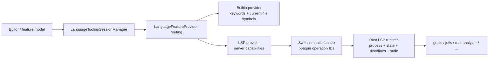

# 语言工具与 LSP 架构

本文说明 Lithe 当前的语言能力分层、LSP 兼容边界，以及接入新语言服务器时必须遵守的约束。公开的 Rust JSON 命令仍以
[`rust-core-api.md`](../../shared/contracts/rust-core-api.md) 为准。

## 设计目标

语言能力不应等同于“已经启动一个 LSP 进程”。当前实现遵循以下规则：

1. 编辑器只依赖统一的 `LanguageFeatureProvider`，不直接依赖具体语言服务器。
2. 轻量本地能力无需外部进程；普通 LSP 按需启动，Java 工作区则在项目识别后异步预热 JDTLS。
3. 可调用的 LSP 功能以服务器 `initialize` 响应和动态注册结果为准，不能根据语言名称硬编码。
4. LSP 进程、stdio、JSON-RPC 状态机、deadline 和结果归一化属于 Rust Core；平台 adapter 只负责可执行文件与运行环境发现。
5. 单个 provider 失败、缺失或返回空结果时，不应阻断仍可工作的本地能力。

## 组件边界



| 层 | 职责 | 不负责 |
| --- | --- | --- |
| `LanguageToolingSessionManager` | 文档同步、provider 选择、结果降级/合并、诊断和会话归属 | JSON-RPC 编解码、直接启动 `Process` |
| `LanguageFeatureProvider` | 声明单项能力、优先级和统一结果类型 | 维护 UI 状态 |
| `BuiltinLanguageFeatureProvider` | 当前文件标识符、轻量 hover/导航、语言关键字 | 类型推断、跨文件索引 |
| `LanguageServerFeatureProvider` | 将已协商的服务器能力适配到统一 provider 接口 | 猜测服务器能力 |
| `StdioLanguageServerSession` | 调用语义命令、投影 typed event，并以不透明 operation ID 交付 UI 回调 | LSP 请求 ID、frame、文档版本、协议超时或子进程 |
| Rust Core | LSP 子进程与 stdio、session/document state、请求 ID、deadline、frame、UTF-16 位置、结果归一化、动态能力 | 可执行文件发现、UI provider 路由 |
| macOS adapter | 工具发现、环境变量和用户可执行文件覆盖 | LSP 子进程、语言功能路由和协议语义 |

Rust Core 的 LSP 实现统一收在 `rust/lithe-core/src/lsp/`，根模块只作为稳定 facade，command runtime 仍通过 `crate::lsp::*` 使用公开契约：

```text
lsp/
├── interface/           # 通用 LSP engine、协议 reducer、transport 与稳定 DTO
│   ├── types.rs
│   ├── client.rs
│   ├── transport.rs
│   ├── host.rs
│   └── engine.rs
├── lightweight/         # 不启动语言服务器的编辑、snippet 和当前文件符号能力
│   ├── edits.rs
│   ├── snippets.rs
│   └── symbols.rs
└── languages/           # provider catalog 与语言/宿主模型 adapter
    ├── catalog.rs
    ├── jdt.rs
    ├── jdt_navigation.rs
    ├── java_navigation_syntax.rs
    └── swift.rs
```

共享的 LSP position/range 与协议 DTO 只能定义在 `interface/types.rs`；对应用公开的 runtime command/event DTO 位于 `interface/engine.rs`。`lightweight` 可以依赖这些协议 DTO，但 `interface` 不依赖轻量实现。`languages/jdt.rs` 封装 JDTLS 启动参数、配置与虚拟源码语义，generic engine 不按 Java 硬编码 capability。provider catalog 位于 `languages`，因为它描述可动态加载的语言/provider 元数据，而不是 client 状态机的一部分。

## Provider 路由

当前优先级由高到低为 `languageServer (200)`、预留的 `projectSymbols (100)`、`builtin (0)`。每次请求先按文件和功能过滤 provider，再按优先级路由：

- **Completion**：依次收集所有成功结果，保持高优先级顺序，并按 `label` 去重。因此 LSP 可提供精确候选，本地关键字和当前文件符号仍能补足结果。
- **Hover**：返回第一个非空结果；LSP 无结果或失败时继续询问本地 provider。
- **Definition/References/Implementation**：返回第一个非空位置列表，并在 LSP 不可用时降级到当前文件文本级导航。
- **Rename/Formatting/Code Action/Resolve/Execute Command**：目前仍是 LSP-only；未运行或未声明相应能力时应返回明确的 capability 错误。

provider 抛错不会让路由提前结束。这个策略用于隔离第三方语言服务器故障，但也意味着新增 provider 时必须给出稳定优先级，并避免返回伪造的“成功但无意义”结果。

## 无进程能力

Rust Core 的 `lsp.builtinCompletions`、`lsp.builtinHover` 和
`lsp.builtinNavigation` 只读取当前文件文本。Swift 层另外为 Go、Swift、Rust、Python、JavaScript 和 TypeScript 提供关键字候选；即使 Rust Core 未链接，关键字补全仍可使用。

JVM 族的编辑器结构识别同样不依赖语言服务器进程：`language.structure` 为
Java、Kotlin、Scala 和 Groovy 返回与 `java.structure` 相同形状的
`foldRegions` 与 `syntaxHighlights`（Java 委托给 Java 解析器，Kotlin、Scala、
Groovy 使用各自的 tree-sitter grammar）。`lsp.builtin*` 对 JVM 族文件按
语言推断补全类型与声明位置（`fun`/`def`/`val`/`var` 等），Gradle 构建脚本
（`.gradle`、`.kts`）与 `Jenkinsfile` 分别归入 Groovy/Kotlin 识别范围。

这些结果是可用性降级，不是类型系统：

- 不解析依赖，不启动构建工具，不访问网络；
- 不保证跨文件定义、重载解析或类型正确性；
- 位置统一使用零基行号和 UTF-16 列，确保可与 AppKit 和 LSP 结果合并。

## Catalog 与工具发现

内置 provider catalog 位于
[`rust/lithe-core/resources/lsp/language-providers.json`](../../rust/lithe-core/resources/lsp/language-providers.json)。项目可以通过 `.lithe/lsp/language-providers.json` 按 `id` 覆盖内置字段、添加 provider，或使用 `disabled: true` 禁用 provider。配置格式由 [`docs/reference/language-providers.schema.json`](../reference/language-providers.schema.json) 定义：

```json
{
  "$schema": "../../docs/reference/language-providers.schema.json",
  "version": 2,
  "providers": [
    {
      "id": "go",
      "languageServerLaunch": {
        "executableNames": ["gopls-custom", "gopls"],
        "arguments": [],
        "environment": {
          "GOTOOLCHAIN": "auto"
        },
        "initializationOptions": {}
      },
      "languageServerInstallation": {
        "homebrewFormula": "gopls",
        "officialDownloadURL": "https://go.dev/gopls/"
      }
    },
    {
      "id": "templ",
      "displayName": "Templ",
      "fileExtensions": ["templ"],
      "capabilities": ["languageServer", "formatting"],
      "activationPolicy": "onDemand",
      "languageId": "templ",
      "languageServerLaunch": {
        "executableNames": ["templ"],
        "arguments": ["lsp"]
      }
    }
  ]
}
```

`executableNames` 按顺序尝试，`environment` 覆盖 Lithe 进程环境中的同名键，`initializationOptions` 原样进入 LSP `initialize` 参数。可选的 `validationArguments` 会在候选进入 session 解析前直接执行，例如 Rust provider 使用 `["--version"]` 排除存在于 `PATH` 但缺少组件的 rustup proxy。探测结果按路径和参数缓存 30 秒，退出码非零或超时的候选不会被视为可用。catalog 更新后，session manager 会丢弃 descriptor 已变化的旧会话和 runtime，并由 runtime factory 根据新 descriptor 延迟创建 runtime；因此项目新增 provider 或覆盖启动命令不再受应用启动时的内置 runtime 列表限制。

macOS discovery 的查找顺序包括项目 `.lithe` 工具目录、`LITHE_<TOOL>_PATH`/`LITHE_TOOL_<TOOL>_PATH`、`PATH` 和常见系统目录；`gopls` 等 Go 工具还会检查 `GOBIN`、`GOPATH/bin`、`~/go/bin` 和 `~/.go/bin`。discovery 只查找，不自动安装软件。

正式 macOS 与 Windows 安装包包含 JDTLS 和只供语言服务使用的 Temurin JDK 21。发布构建根据 `third_party/jdtls/manifest.json` 下载固定版本，同时校验 JDTLS 归档、EPL-2.0 许可证、Lombok agent 与 MIT 许可证的 SHA-256，再将产物放入应用资源目录的 `LanguageServers/jdtls`。平台 adapter 从选中的安装目录稳定解析 Equinox launcher JAR、当前平台的 configuration 目录和 `lombok/lombok.jar`，以结构化 `jdtlsLaunchResources` 提交给 Rust Core；Core 统一构造 `-javaagent`、内存、module/open、Eclipse product/application、`-jar`、`-configuration` 和 workspace `-data` 参数，并直接启动包内 `java`/`java.exe`。因此正式包运行 JDTLS 不依赖 shell、PowerShell 或用户 `PATH`。资源缺失会在进程启动前作为打包故障明确失败，不会产生静默的错误诊断。生成的 `bin/jdtls`、`jdtls.bat` 和 `jdtls.ps1` 只为外部/旧启动计划保留兼容回退；运行 JDTLS 的 Java runtime 始终只能是内置 JDK 21。下载只发生在构建阶段，应用运行时不会联网安装 JDTLS、Lombok 或 JDK。

准备脚本会把经过校验的 JDTLS manifest 一同复制到 `LanguageServers/jdtls/manifest.json`。平台启动 adapter 只观测 workspace 根部的 `pom.xml`、`build.gradle`、`build.gradle.kts` 元数据、直接包含 `pom.xml` 的模块目录和实际选中 JDTLS 的版本；`java.jdtWorkspaceFingerprint` 在 Rust Core 内统一校验、排序、去重并生成非递归结构指纹，平台不得拼接或解析该字符串。Rust Core 将指纹和标准化 workspace 路径共同哈希为 `-data` 目录键；结构变化只会选择新目录，不影响当前会话。缺少指纹时仍使用历史的纯路径键，兼容旧客户端。两端在使用缓存时写入最近使用标记，再把目录元数据交给 `java.jdtCacheRetention`；Core 只返回超过 30 天且非当前活动项的键，平台复核后删除，Core 不执行文件系统操作。

命令面板的 **Java: Rebuild Index** 是损坏索引的人工恢复路径。平台先停止当前 workspace 的语言服务器会话，再通过 Core 的同一键算法只删除当前 workspace 与当前结构指纹对应的目录。其他项目和该项目的旧结构缓存均保留，重新打开 workspace 时按正常预热流程重建。

JDTLS runtime 与项目运行/调试 JDK 完全分离。产品只接受随应用发布且校验为主版本 21 的 Temurin JDK，不读取系统 `JAVA_HOME`，也不提供用户路径设置；缺失或版本错误按打包故障提示。项目 Run/Debug 的 Java/Maven JDK 配置继续独立存在。

LSP 控制中心标题栏的工具设置会在用户偏好中保存每个 provider 的可执行文件覆盖路径。session 创建时先验证并使用该路径，路径失效时继续使用 catalog 候选进行自动探测。Homebrew formula 和官方兜底地址都来自 `languageServerInstallation`，Swift 不维护 provider ID 映射。安装仍由平台层以参数数组直接执行 `brew install`，不经过 shell；没有 Homebrew/formula 时只打开对应项目的 HTTPS 官方发布或安装页面，避免用一套不安全的通用解压逻辑处理不同项目的签名和包结构。

项目配置是可执行工具配置，只有打开受信任项目时才应启用。JSON 可以声明 executable name 和参数，但不能声明 shell、任意安装命令或关闭路径/URL 校验；进程创建、超时、可执行文件验证、Homebrew 调用方式和 HTTPS 限制仍属于平台安全边界。

## LSP 会话与兼容性

当前 transport 是 LSP 标准的 stdio `Content-Length` framing。一个 provider 在一个 workspace root 下复用一个 session；同一 provider 切换到另一个 root 时，manager 会停止旧 session 并创建新 session。`java.workspacePolicy` 只要在非忽略目录发现有效 `.java` 文件就请求异步预热，不依赖 Maven/Gradle，也不需要先打开 Java 标签页；会话由 workspace 持有并在 workspace 关闭时停止。

生产路径由 Rust engine 持有长生命周期 `sessionID -> RuntimeSession` registry。每个 runtime 同时拥有子进程、stdio、frame buffer、文档版本、pending request/deadline、capability 和 diagnostics；Swift 只保存不透明 `sessionID` 与 application-level `operationID`。`syncDocument` 由 Rust 决定发送 version 1 的 `didOpen` 或递增版本的 `didChange`；当 server 声明 Incremental `textDocumentSync` 且请求携带 range 时发送 range-based `didChange`，否则发送全文。`pollEvents` 立即排空队列；`waitEvents` 在 session 事件 channel 上等待直到有事件或超时后再排空 typed state/feature/diagnostic/result/error 事件。协议 reducer/host 只作为 engine 内部实现与纯函数测试 seam，不属于应用公开命令面。

平台 adapter 只能投影 Rust 发布的 lifecycle，不能再用多个布尔字段复制一套 session 状态机。Windows 的 adapter 负责持有并清理 event pump、semantic request timer 和 file attachment；React 文档 owner 负责初始化 Promise、变更队列和 debounce timer。所有启动、成功、失败、取消和超时记录都保留同一个 `operationId`，旧 attachment 的完成结果不得修改新 owner 的状态。

会话生命周期必须是单一判别状态；capability 协商单独表示为 `unknown` 或
`known`，不能由 `ready`、`featuresKnown`、`supportsFeature` 等多个布尔字段组合推导。
跨边界失败必须保留稳定的 `code`、`stage`、退出码和诊断详情，不能通过错误文本猜测
timeout。Core、service 和 adapter 只返回稳定原因，面向用户的提示文案由各端 UI
本地化资源统一生成。

启动顺序：

1. 平台完成可执行文件、运行时和 provider 专用资源发现，向 Rust 提交 typed `startServer`；JDTLS 包内计划必须包含 `jdtlsLaunchResources`；
2. Rust provider adapter 生成最终参数，engine 创建 session、直接启动目标进程并安装 stdout/stderr reader，再发送 `initialize`；
3. 收到响应后，Rust 保存服务器 capability，发送 `initialized` 和 provider adapter 通知；JDTLS 的配置通知和 `workspace/configuration` 响应通过 `java.configuration.maven.userSettings` 消费当前 Maven `settings.xml`，随后继续等待 `language/status: ServiceReady`；
4. JDTLS 报告 `ServiceReady` 后，Rust 对 reactor 和每个递归 Maven module 发送 `java.project.updateSettings`，以 `org.eclipse.m2e.core.selectedProfiles` 应用排序后的 Profiles；所有响应成功前仍保持 `initializing`，拒绝或超时会明确失败而不沿用旧 Maven model；
5. manager 只在真实 `ready` 后发布 capability；打开文档发送 `didOpen`，后续编辑优先按服务器协商结果发送增量 `didChange`；
6. Rust 以 LSP request ID 关联 deadline，并用不透明 operation ID 把 terminal result 投影给 Swift。

`initializeTimeoutMilliseconds` 只约束标准 LSP 握手。JDTLS 返回 initialize
结果后，Core 立即切换到独立的 `ServiceReady` 等待：连续 45 秒没有变化的
`$/progress` 才判定 idle timeout，同时保留 10 分钟绝对上限。百分比增长、阶段或
模块变化、下载字节增长都属于有效进展；完全重复的消息不续期。平台 adapter 不得再
添加自己的固定 readiness deadline。最终 ready 仍只认
`language/status: ServiceReady`，进度文本解析只服务于日志和超时快照。

Java import 日志以节流后的结构化 JSON detail 发布，至少保留 phase、百分比、当前
模块、观察到的模块数、artifact、仓库 host、已下载/总字节、估算吞吐、elapsed、idle
和 `cacheDisposition`。超时使用 `serviceReadyTimeout`/`serviceReady`，并以
`networkDownloadStalled`、`networkTransferActive`、`noProgressStall` 或
`projectImportActive` 标明最后状态。JDTLS workspace 已存在 `.metadata` 时记为
`reused`，否则记为 `new`。

JDTLS 初始化配置不主动下载 Maven/Eclipse source attachment；依赖 POM/JAR 仍按
项目模型需要正常解析。外部依赖没有源码包时，跳转使用已有的 class-file/decompile
能力，从而把非必要源码下载移出首次 `ServiceReady` 关键路径。

服务端 capability 可以来自 initialize 响应，也可以通过 `client/registerCapability` 和
`client/unregisterCapability` 动态变化。客户端处理有文档/version 归属的 diagnostics、workspace configuration/folders、work-done progress 和 apply-edit 协议；未知的服务端 request 返回 JSON-RPC `Method not found`，未知 notification 作为 typed log/event 保留。

关闭文档时发送 `textDocument/didClose` 并清除该文档诊断。停止 session 时先请求 `shutdown`，收到响应后发送 `exit`；若服务器无响应，则由超时路径强制停止进程。不要直接以 `terminate()` 代替正常 LSP 关闭流程。

Java source 编辑只走单调版本的文档同步，不重启 JDTLS，也不清理索引。workspace watcher 在 350ms 窗口内合并变化；已打开 Java 文档由 `didChange` 独占，未打开源码和 Maven/Gradle 文件通过 `workspace/didChangeWatchedFiles` 通知。构建文件变化可以触发一次合并后的项目服务刷新，但不会按每次按键重建会话。用户在 `startingProcess`/`initializing` 阶段触发导航时只收到“Java 服务正在准备”的通知，本次操作立即结束，ready 后不会自动跳转。

Java gutter 导航由 Rust Core 统一投影。`java_navigation_syntax.rs` 只用
tree-sitter 选择真实声明候选，`jdt_navigation.rs` 负责固定上限的任务规划、
部分结果合并、排序和去重；Windows 与 macOS 只渲染 `up/down ×
interface/inheritance` 四类图标并展示跳转结果。编辑器对 marker 刷新做 180ms
防抖；Core 对完全相同的同步文本不发送 `didChange`，并缓存同一 URI/版本的
marker 结果。新版本会取消旧批次并使缓存失效，因此频繁输入不会累计旧的
CodeLens、implementation 或 `java/findLinks` 请求。没有语义目标的声明不显示
图标；一个目标直接跳转，多个目标由平台 UI 显示选择列表。

MyBatis Mapper 到 XML 的跳转不经过 JDT LS。`mybatis.index` 用 `tree-sitter-java`
提取真实接口方法，再与 XML `<mapper namespace>` 中的 statement `id` 配对；
Go to Definition 和 Cmd/Ctrl-click 仅在光标落在方法名或 XML `id` 上时优先
使用该索引，返回类型和参数仍走语言服务器。没有配对 XML 的方法继续走普通
LSP 定义跳转。

Java 测试类与方法同样不能由 UI 猜测。Tests 面板打开或刷新时，
`LanguageToolingSessionManager` 直接调用 JDT LS 已注册的 Java Test 扩展命令
`vscode.java.test.findTestTypesAndMethods`，将 JDT 返回的类、方法、框架和
全限定标识投影为平台无关的测试项。UI 只展示并回传稳定标识；JUnit/TestNG 的
Debug 启动继续由 JDT 生成项目参数，再交给 Rust Debug Core 归一化。测试发现本身
不会创建 Debug 会话、回环 socket 或目标 JVM，关闭面板、切换项目和重载 Java
runtime 都会取消尚未完成的发现任务并丢弃晚到结果。

### 当前限制

- 只支持 stdio transport，尚无 socket/TCP 或服务器自定义握手 adapter。
- session 当前以 provider ID 和单个 workspace root 为单位，尚无 multi-root session。
- `workspace/applyEdit` 只提供协议确认和 normalized edit 数据，实际应用仍必须经过编辑器工作区安全校验。
- initialize 可协商 snippet、resolve、inlay hint、folding range、code lens 和 workspace symbol；UI 只启用已完整投影且服务器实际声明的能力。
- 编辑器提供可靠 range 时发送增量文本变化；缺少增量信息或服务器只接受 full sync 时回退为全量文本。
- catalog 描述的是“可尝试启动的工具”；最终功能必须以运行时服务器 capability 为准。
- project config 是受信任的项目配置，只接受 schema 中的 typed 字段，不执行 shell 命令。

## 接入新 LSP 的检查清单

1. 在 catalog 中定义稳定 `id`、文件匹配规则、`languageId`、候选 executable 和参数；存在 shim/proxy 的工具应声明无副作用的 `validationArguments`。
2. 需要安装入口时定义 `languageServerInstallation`；不要在 Swift UI 中增加 provider ID 分支。
3. 确认服务器支持 stdio 和标准 `Content-Length` framing。
4. 不在 UI 或 manager 中按语言写分支；服务器差异应进入 descriptor 或独立 adapter。
5. 用 initialize 响应验证 capability，不把 catalog 的 `languageServer` 标记当成 feature 支持证明。
6. 至少测试 initialize timeout/error、didOpen/change/close、请求 timeout/late response、shutdown/exit、强制停止和异常退出。
7. 包含 malformed/partial/multiple frame、动态能力、stale diagnostics、UTF-16、带空格/非 ASCII 文件 URI，以及启动即输出的场景。

## 真实 gopls 验证

[`RealGoplsIntegrationTests.swift`](../../macos/Tests/LitheTests/RealGoplsIntegrationTests.swift)
会穿过 manager、Swift semantic facade 和拥有进程的真实 Rust Core。测试默认不启动外部工具，需要显式开启：

```bash
scripts/build-rust-core.sh --debug --target aarch64-apple-darwin

LITHE_RUN_GOPLS_INTEGRATION=1 \
LITHE_GOPLS_PATH="$HOME/.go/bin/gopls" \
swift test --disable-sandbox --no-parallel \
  --triple arm64-apple-macosx \
  -Xswiftc -Xfrontend -Xswiftc -disable-round-trip-debug-types \
  -Xlinker -force_load \
  -Xlinker "$(pwd)/rust/target/macos/aarch64-apple-darwin/debug/liblithe_core.a" \
  --filter RealGoplsIntegrationTests
```

`-force_load` 是必要条件：测试包同时包含 C bridge 的 weak fallback；普通链接可能在没有加载 Rust archive 的情况下仍然成功。Intel macOS 需要把 target/triple 和库路径替换为对应的 `x86_64` 产物。
